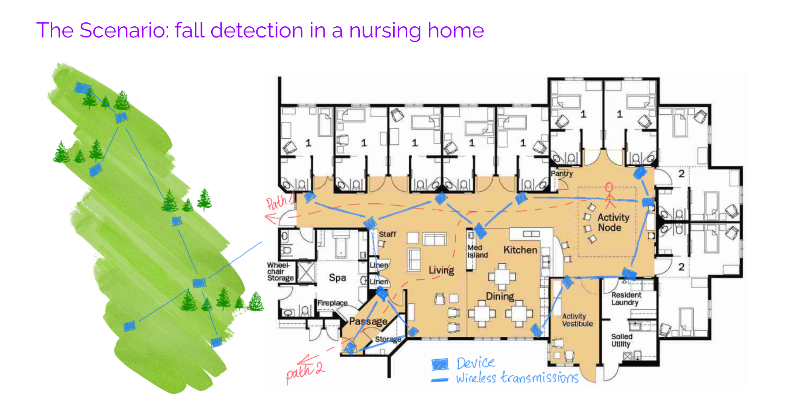
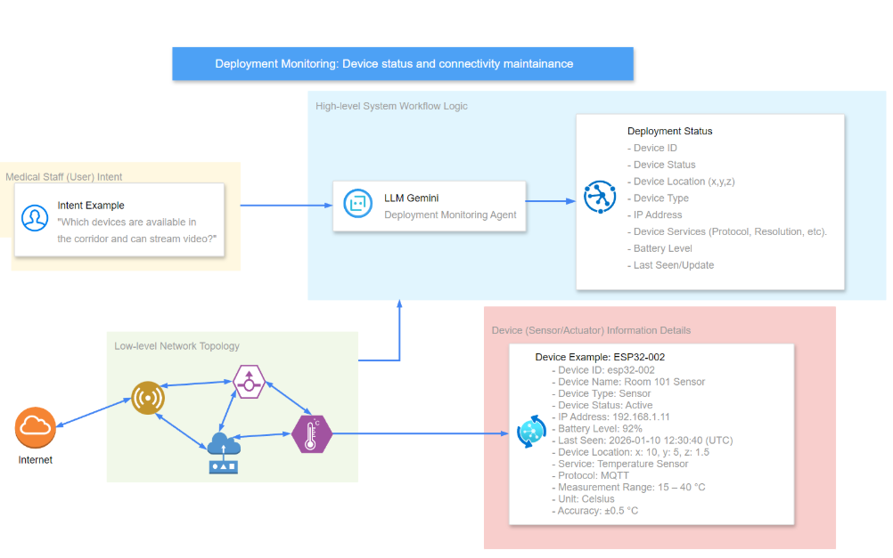

# Large Language Models for the fall detection system deployment scenario in Nursing Home environment. 


## Overview

Modern medical research laboratories have integrated gradually into smart workspace environments, with the integration of heterogeneous IoT devices and services [2,3]. Large Language Models (LLMs) have emphasized the capabilities in reasoning, planning, and task orchestration, providing a promising methodology for translating natural user intents into executable laboratory operations [4,5]. This project aims to develop an LLM-driven deployment engine [1,6] for medical research laboratories. The system (Figure 1) enables clinicians to interact with medical datasets, IoT-connected sequencing devices, and AI models through natural language queries, automating data retrieval, analysis, and workflow execution [7]. 



---

## Project Structure

```
iot-embedded-systems/
├── src/
│   ├── main.py                    # CLI entry point (LLM Agent → MCP execution)
│   ├── llm/
│   │   ├── __init__.py
│   │   ├── system_prompt.txt      # Operation prompts
│   │   └── agent.py               # LLM Agent 
│   ├── mcp_server/
│   │   ├── main.py                # FastMCP server entry point
│   │   └── tasks/                 # FastMCP server instance
│   ├── api/                       # FastAPI client
│   └── db/                        # Database schema (SQLite)
├── test/                          # Unit tests
├── tools/                         # Utility tools
├── swagger.json                   # API specification docs
├── pyproject.toml                 # Poetry dependencies
└── .env.template                  # Environment variables
```

---

## Quick Setup

### Prerequisites
```bash
# Dependencies installation fully pinned via poetry.lock (deployment lock standard)
poetry install --no-root
uv sync  # WebUI package 

```

### Running the Application (LLM User Intent)

```bash
# Lauch Open WebUI  
uv run --with open-webui open-webui serve
poetry run uvicorn src.main:app --host 0.0.0.0 --port 8001
```

---
## Basic Flow: From LLM User Intent to ESP32 camera-based deployment control.
The deployment monitoring agent (Figure 2) is responsible for maintaining an up-to-date data structure that records the status of each device and its connectivity. 


### 1. LLM to MCP (Tool Registration)
- LLM Deployment Agent maintains real-time data structures for all deployed devices with unique identifiers. For each device, some information details such as registered microservices (`/camera`, `/sensor`, etc.), communication protocols (HTTP, MQTT, CoAP), and service-specific metadata (e.g., camera FoV, detection area, resolution, sampling frequency).

- MCP Server tools are registered in the agent and correspond to network operations, current tools are, with full CRUD (create, read, update and delete) functionality.

WebUI has supported 2 LLMs model (OpenAI, Ollama), implement FastAPIs to retrieve model & chat information, all the API docs in http://localhost:8001/docs#/ with the launching interface in http://localhost:8001 for local version, further deploy in Vercel.


### 2. MCP to ESP32 (FastAPI Bridge)

- MCP server (`src/mcp_server/`) receives tool calls from the agent and maps them to REST endpoints. FastAPI clients translate LLM-generated tool calls into HTTP requests targeting actual ESP32 devices via deployment endpoints (`/api/deploy`, `/api/control`, `/api/status`). All service details (**devices**, etc) documented in `swagger.json`.

> **Note:** Some tools and API mappings are under development, see more in `src/mcp_server` for tool registration.

### 3. ESP32-CAM Execution (Device layer)

- ESP32-CAM device receives deployment instructions, loads camera-based fall detection models, configures inference pipelines, and executes real-time monitoring workflows. Device details (IP address, device status (active, inactive, idle, sleep, deep sleep), location coordinates (x, y, z)) streamed back to FastAPI for SQLite database retrieve, with the implementations in `esp32/` for resource-constrained devices.

---

## References

### Theory-based ressources 

[1] LLMind: Orchestrating AI and IoT with LLM for Complex Task Execution. arXiv. Available: https://arxiv.org/pdf/2312.09007

[2] SmartIntent: A Serverless LLM-Oriented Architecture for Intent-Driven Building Automation. ResearchGate. Available: https://www.researchgate.net/publication/397059674

[3] LLM Agents for Internet of Things (IoT) Applications. CS598 JY2-Topics in LLM Agents. Available: https://openreview.net/pdf?id=BikB3f8ByV

[4] A Survey on IoT Application Architectures. MDPI Sensors. Available: https://www.mdpi.com/1424-8220/24/16/5320

[5] Tree-of-Thought vs Chain-of-Thought for LLMs. arXiv. Available: https://arxiv.org/html/2401.14295v3

[6] Introduction to Model Context Protocol. Available: https://anthropic.skilljar.com/introduction-to-model-context-protocol

[7] Model Context Protocol (MCP): Landscape, Security Threats, and Future Research Directions. arXiv. Available: https://arxiv.org/pdf/2503.23278

### Code implementation ressources (Additional)
1. MCP SDK Integration: [modelcontextprotocol.io/docs/sdk](https://modelcontextprotocol.io/docs/sdk)
2. MCP Learning Resources: [youtu.be/QIOk4XZ5XNU](https://youtu.be/QIOk4XZ5XNU)
3. Integration with FastMCP via [langchain-mcp-adapters](https://github.com/langchain-ai/langchain-mcp-adapters)
5. Pipx: [github.com/pypa/pipx](https://github.com/pypa/pipx)
6. Poetry: [python-poetry.org/docs](https://python-poetry.org/docs)

---
## Future Work
1. Hazel 
- Implement deployment algorithms & test case in camera-based scenarios.

2. Massinissa
- Monitoring workflow and implement prototype with Hazel.